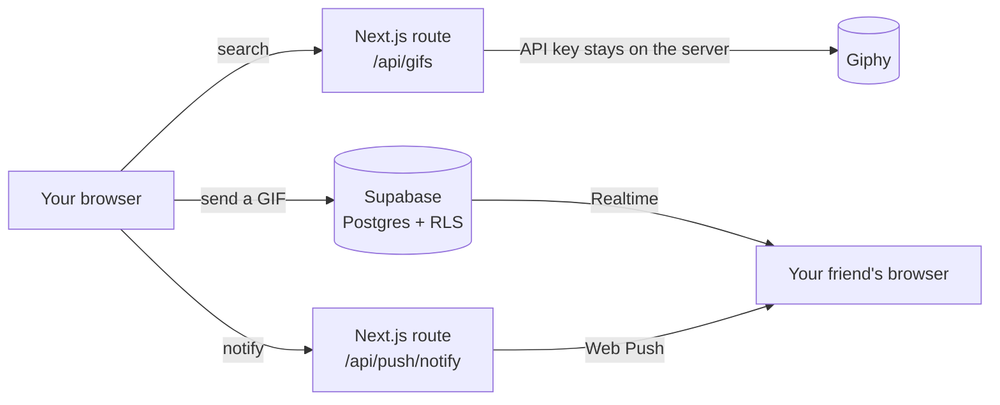
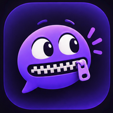

<p align="center">
  
</p>

<h3 align="center">The chat app that only speaks GIF.</h3>

<p align="center">
  No keyboard. No words. Just GIFs, delivered in real time.
</p>

<p align="center">
  
  
  
  
  
  
</p>

---

<!--
  Screenshots: drop images in .github/assets/ and uncomment this block.

<p align="center">
  
</p>
-->

## Features


- **GIFs only.** The message box is a GIF search engine. That's the whole idea.
- **Real time.** Messages appear instantly on both sides, over Supabase Realtime.
- **Friends system.** Send, accept, decline or cancel requests by username.
- **Unread badges.** Conversations are sorted by latest activity, with a counter per friend.
- **Presence.** See who is online, without storing anything in the database.
- **Anonymous accounts.** Sign up with a username and a password, no email required. Google sign-in is also available.
- **Installable.** A PWA with an offline page, safe-area support for notched phones and a mobile drawer layout.
- **Push notifications.** Optional, via the Web Push standard.

## How it works



The Giphy key never reaches the browser: every search goes through a server route. Every table is protected by PostgreSQL **Row Level Security**, so a user can only ever read the conversations they belong to.

## Tech stack

| Layer | Choice |
| --- | --- |
| Framework | Next.js 16 (App Router, Server Actions) |
| UI | React 19, Tailwind CSS 4, Lucide icons |
| Database | Supabase PostgreSQL with Row Level Security |
| Auth | Supabase Auth: username/password and Google OAuth |
| Real time | Supabase Realtime: Postgres changes and Presence |
| GIFs | Giphy API, proxied server-side |
| Notifications | Web Push (VAPID), service worker |
| Hosting | Vercel |

## Getting started

### 1. Install

```bash
git clone https://github.com/<you>/mutechat.git
cd mutechat
npm install
cp .env.example .env.local
```

### 2. Environment variables

| Variable | Required | Where to find it |
| --- | --- | --- |
| `NEXT_PUBLIC_SUPABASE_URL` | yes | Supabase → Project Settings → API |
| `NEXT_PUBLIC_SUPABASE_ANON_KEY` | yes | Supabase → Project Settings → API |
| `GIPHY_API_KEY` | yes | [developers.giphy.com](https://developers.giphy.com/dashboard/) |
| `NEXT_PUBLIC_VAPID_PUBLIC_KEY` | no | `npm run vapid` |
| `VAPID_PRIVATE_KEY` | no | `npm run vapid` |
| `VAPID_SUBJECT` | no | `mailto:you@example.com` |

Without the VAPID keys, push notifications are simply disabled. Everything else works.

### 3. Database

In the Supabase SQL Editor, run:

| Situation | Script |
| --- | --- |
| New project | `supabase/setup.sql` |
| Existing project | `supabase/migrations/0001_fix_rls_recursion.sql`, then `0002_unread_presence_push.sql` and `0003_english_messages.sql` |

All scripts are idempotent and never delete data.

Then, in **Authentication → Providers → Email**, turn off **Confirm email**. Anonymous accounts use placeholder addresses that can't receive a confirmation link.

### 4. Run

```bash
npm run dev
```

Open [http://localhost:3000](http://localhost:3000).

## Project structure

```
src/
├── app/
│   ├── api/gifs/            Giphy proxy: search and trending
│   ├── api/push/            Push subscriptions and delivery
│   ├── auth/callback/       Google OAuth callback
│   ├── chat/                Chat layout, home and conversation pages
│   ├── login/               Login page and Server Actions
│   └── manifest.ts          PWA manifest
├── components/              ChatRoom, GifPicker, Sidebar, dialogs, toasts…
├── lib/                     Environment, events, error helpers
├── types/database.ts        Domain types, mirroring the SQL schema
└── utils/supabase/          Browser, server and middleware clients
supabase/
├── setup.sql                Full schema
└── migrations/              Incremental changes
```

## Security notes

- **No self-referencing policies.** A policy that queries its own table triggers `infinite recursion detected in policy`. Membership checks go through a `security definer` function, evaluated outside RLS.
- **Sensitive writes go through RPCs.** Conversations and participants have no `INSERT` policy: only `get_or_create_direct_conversation()` can create them, after checking the friendship, and under an advisory lock to avoid duplicates.
- **No service role key.** Push delivery uses a `security definer` RPC that checks the caller belongs to the conversation before returning anything.

## Scripts

| Command | Description |
| --- | --- |
| `npm run dev` | Development server |
| `npm run build` | Production build |
| `npm run start` | Serve the production build |
| `npm run lint` | ESLint |
| `npm run typecheck` | TypeScript check |
| `npm run vapid` | Generate a VAPID key pair |

## Deployment

1. Import the repository on [Vercel](https://vercel.com/new).
2. Add the environment variables above. `NEXT_PUBLIC_*` values are baked in at build time: redeploy after changing them.
3. In Supabase → **Authentication → URL Configuration**, set the Site URL to your Vercel domain and add `https://<your-domain>/auth/callback` to the redirect URLs.

## Acknowledgements

Built with the help of [Claude](https://claude.ai) by Anthropic. GIFs powered by [GIPHY](https://giphy.com).

<p align="center">
  
</p>
